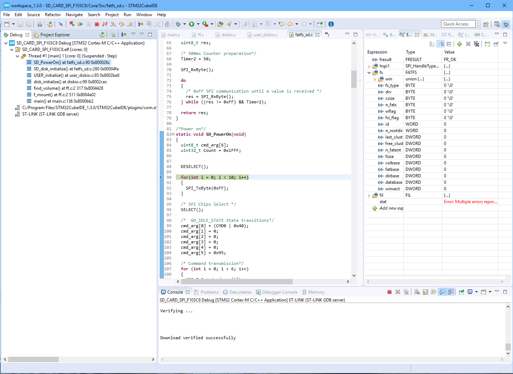

### Домашние часы-термометр

Проект по объединению всех предыдущих наработок:

- Опрос датчика давления и температуры [BMP280](../literature/sensors/bst-bmp280-ds001.pdf)   
- Опрос DHT11 (раз в 3 секунды, только влажность)
- Опрос часов реального времени [DS3231](../literature/sensors/DS3231.pdf)
- Вывод на LCD I2C 16x2
- Запись данных на SD-карту с помощью библиотеки-прослойки FatFS в формате

```
23:38:31 SUN 24/01/21 T = 28.08*C H = 37% P = 99161.98 Pa
23:38:32 SUN 24/01/21 T = 28.09*C H = 37% P = 99164.98 Pa
23:38:33 SUN 24/01/21 T = 28.08*C H = 37% P = 99164.20 Pa
23:38:34 SUN 24/01/21 T = 28.08*C H = 37% P = 99164.53 Pa
23:38:35 SUN 24/01/21 T = 28.08*C H = 37% P = 99161.66 Pa
```

### Описание подключения

| STM32F103C8T6 | Назначение | Комментарий |
| :-----:       | :------:   | -------     |
| PA4			| SPI1_NSS   | SPI1 для SD-карты.  |
| PA5			| SPI1_SCK   | Аппаратное управление выводом ~CS|
| PA6			| SPI1_MISO  ||
| PA7			| SPI1_MOSI  ||
| PA13          | SWDIO      |  Внутрисхемный отладчик |
| PA14          | SWCLK      ||
| PB6           | I2C1_SCL   | Часы реального вмемени и  |
| PB7           | I2C1_SDA   | LCD 16x2 через расширитель портов|
| PB8           | DHT 11     ||
| PB10          | USART3_TX  | В целях отладки |
| PB11          | USART3_RX  ||


- Подключение BMP280

| BPM 280       | Назначение | Комментарий |
| :-----:       | :--------: | --- |
| SDO			| GND        | Мл. бит адреса 0x76 при работе с инт. I2C |
| CSB			| VCC        | Выбор интерфейса I2C |
| SDA			| PB7        ||
| SCL			| PB6        ||
| GND           | GND        ||
| VCC           | VCC        ||

**Сложности отладки**


    main.c
        find_volume() at ff.c 2 317
            disk_initialize() at diskio.c 99
                USER_initialize() at user_diskio.c 85
                    SD_disk_initialize() at fatfs_sd.c 280
                        SD_PowerOn() at fatfs_sd.c 90