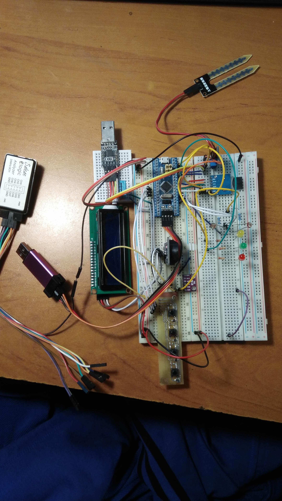
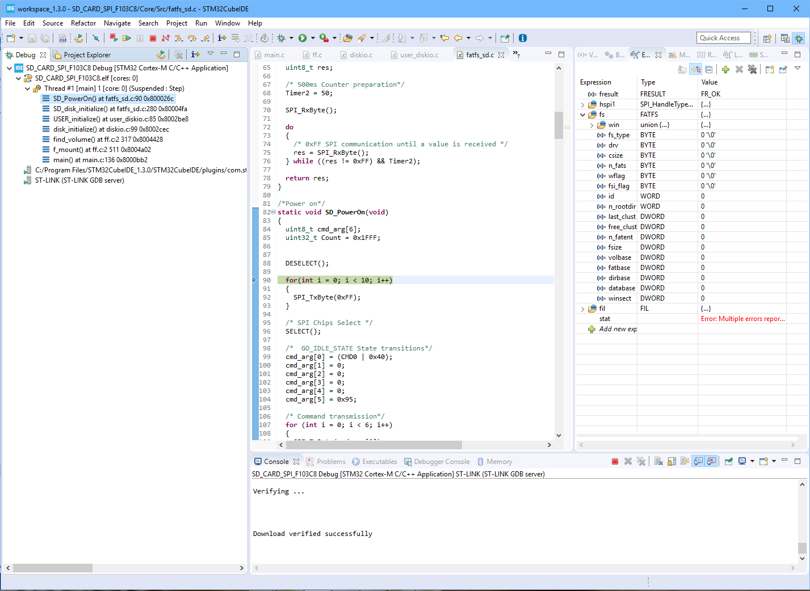

# Домашняя метеостанция-часы

Проект по объединению всех предыдущих наработок:

- Опрос датчика давления и температуры [BMP280](../literature/sensors/bst-bmp280-ds001.pdf)   
- Опрос DHT11 (раз в 3 секунды, только влажность)
- Опрос часов реального времени [DS3231](../literature/sensors/DS3231.pdf)
- Вывод на LCD I2C 16x2
- АЦП для измерения двух фоторезисторов и датчика влажности почвы
- Внешние прерывания для настройки часов реального времени. Фильтрация дребезга контактов аппаратная
с помощью инверсного триггера Шмитта 
- Отладка по USART
- Независимый сторожевой таймер для исключения каких бы ни было зависаний
- Запись данных на SD-карту раз в 10 секунд с помощью библиотеки-прослойки FatFS



### Формат посылки
```
Время    День Дата    Температура Влажность Давление     Вл. почвы Освещённость 1 и 2

21:56:00 MON 26/01/21 T = 26.96*C H = 40% P = 98539.83 Pa S = 4016 L1 = 1203 L2 = 1894
21:56:01 MON 26/01/21 T = 26.97*C H = 40% P = 98545.28 Pa S = 4025 L1 = 1209 L2 = 1903
21:56:02 MON 26/01/21 T = 26.95*C H = 40% P = 98540.83 Pa S = 4011 L1 = 1205 L2 = 1899
...
```

### Потребляемые ресурсы
| |   |
| ---   | --- |
| **Release** |   |
| RAM         | 28,59%  |
| Flash       | 57,18%  |
| **Debug**   |   |
| RAM         | 28,59%  |
| Flash       | 86,08%  |

- Нормальный цикл измерения занимает 25 мс, из которых 20 мс МК ждёт ответа от DHT 11. 
- 50 мс требуется на отправку 880 байт по SPI раз в 10 секунд

### Описание подключения

| STM32F103C8T6 | Название   | Комментарий |
| :-----:       | :------:   | -------     |
| PA4			| SPI1_NSS   | SPI1 для SD-карты  |
| PA5			| SPI1_SCK   | Аппаратное управление выводом ~CS|
| PA6			| SPI1_MISO  ||
| PA7			| SPI1_MOSI  ||
| PA0           | ADC0       |  Датчик влажности почвы |
| PA1           | ADC1       |  Фоторезисторы №1 и №2           |
| PA2           | ADC2       |   |
| PA13          | SWDIO      |  Внутрисхемный отладчик |
| PA14          | SWCLK      ||
| PB0           | Debug LED  | Светодиод для отладки   |
| PB3           | Set        | Кнопки настройки часов. Нажатие выбирает каждый следующий параметр для настройки:  |
| PB4           | Minus      | часы, минуты, секунды (только сброс), дату, месяц, год и день недели |
| PB5           | Plus       ||
| PA15          | x10        | При удержании текущий параметр увеличивается (или уменьш. соотв.) на 10, кроме дня недели |
| PB6           | I2C1_SCL   | Часы реального вмемени и  |
| PB7           | I2C1_SDA   | LCD 16x2 через расширитель портов|
| PB8           | DHT 11     ||
| PB10          | USART3_TX  | В целях отладки |
| PB11          | USART3_RX  ||


- Подключение BMP280

| BPM 280       | Назначение | Комментарий |
| :-----:       | :--------: | --- |
| SDO			| GND        | Мл. бит адреса 0x76 при работе с инт. I2C |
| CSB			| VCC        | Выбор интерфейса I2C |
| SDA			| PB7        ||
| SCL			| PB6        ||
| GND           | GND        ||
| VCC           | VCC        | +3.3V |

- Шкала аналоговых значений датчика влажности почвы

| Значение      | Комментарий | 
| :-----:       | :-------- | 
| `> 4000	    | Разрыв                                   |
| `>3700			| Если взяться пальцами                    |
| 1400 ... 300  | Стакан с водой                           |
| < 400         | Короткое замыкание проводом по выводам   |


### Описание алоритма

1. void main():
    - цикл опроса датчиков и вывода на экран
        + BME
        + 
        + 
    - цикл настройки часов
        + считывание данных из часов
        + вывод (нормальный или с миганием) с секундами
        
2. Обработка кнопок по прерываниям:
    - PB3 -> EXTI_3
    - PB4 -> EXTI_4
    - PB5 -> EXTI_9_5
    
    В каждом прерывании происходит обновление структуры `myRTC` и запись в модуль.
    На данный момент иногда ловятся ошибки 'buffer error in set_RTC' при слишком активном нажатии клавиш.
    Происходит зависание МК намертво

3. TODO:
    - Попробовать сделать АЦП с инжектированными каналами для ускорения

***
### Пересчёт атмосферного давления 

<style TYPE="text/css">
code.has-jax {font: inherit; font-size: 100%; background: inherit; border: inherit;}
</style>
<script type="text/x-mathjax-config">
MathJax.Hub.Config({
    tex2jax: {
        inlineMath: [['$','$'], ['\\(','\\)']],
        skipTags: ['script', 'noscript', 'style', 'textarea', 'pre'] // removed 'code' entry
    }
});
MathJax.Hub.Queue(function() {
    var all = MathJax.Hub.getAllJax(), i;
    for(i = 0; i < all.length; i += 1) {
        all[i].SourceElement().parentNode.className += ' has-jax';
    }
});
</script>
<script type="text/javascript" src="https://cdnjs.cloudflare.com/ajax/libs/mathjax/2.7.4/MathJax.js?config=TeX-AMS_HTML-full"></script>


- Вывод формул на `LATEX` в Markdown
    ```text
        $$ p_мм.рт.ст. = p_Паскали / 133.3224
    ```
    + 
    + 


**Сложности отладки**


    main.c
        find_volume() at ff.c 2 317
            disk_initialize() at diskio.c 99
                USER_initialize() at user_diskio.c 85
                    SD_disk_initialize() at fatfs_sd.c 280
                        SD_PowerOn() at fatfs_sd.c 90