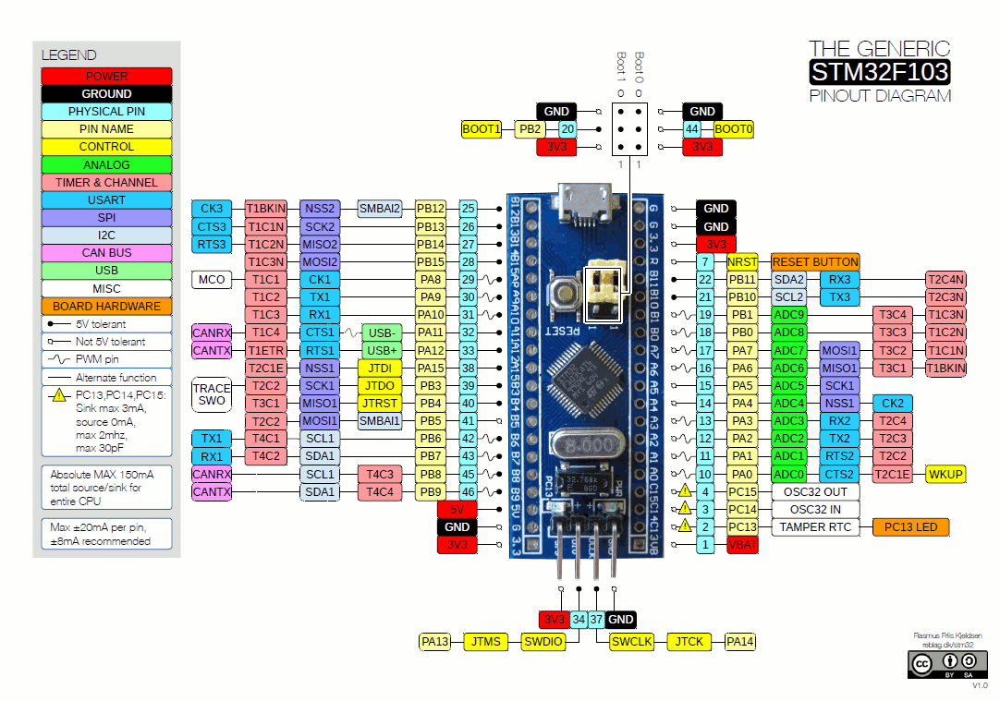
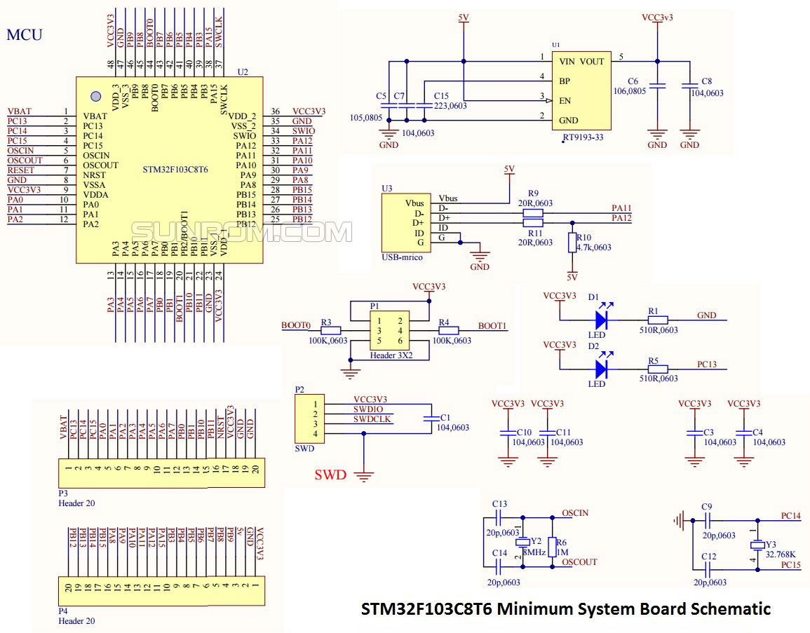
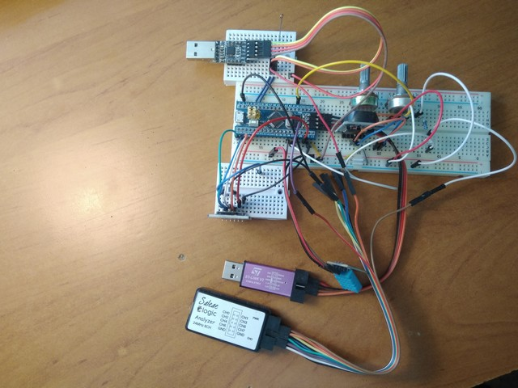

### Лабораторные по программированию stm32 в рамках курса 
#### *"Интеллектуальные системы в мехатронике и робототехнике"*

Используемое ПО:

1. Конфигуратор CubeMX (https://www.st.com/en/development-tools/stm32cubemx.html)
2. Среда CubeIDE (https://www.st.com/en/development-tools/stm32cubeide.html)
3. Утилита для прошивки CubeProg (https://www.st.com/en/development-tools/stm32cubeprog.html)
4. Serial Terminal от Eltima Software
5. Saleae Logic 1.2.18
6. Библиотека HAL

- **Лабораторная №1** с.13 Мигание светодиодом по таймеру, вариант 4
- **Лабораторная №2** с.31 Изучение АЦП, программная реализация ШИМ, вариант 4
- **adc_to_pwm-1** Аппаратное управление ШИМ, другие варианты

- **Лабораторная №3** с.43 Построение разомкнутой системы управления ДПТ
- **Лабораторная №4** с.47 Построение замкнутой системы управления ДПТ
- **Лабораторная №5** с.49 Исследование нейросетевого регулятора
- **Приложение А** с.50 Программа для ознакомления с модулями RCC, GPIO, TIM
- **Приложение Б** с.52 Программа для ознакомления с модулями МПС ADC и таймером в режиме формирования ШИМ

***

***

